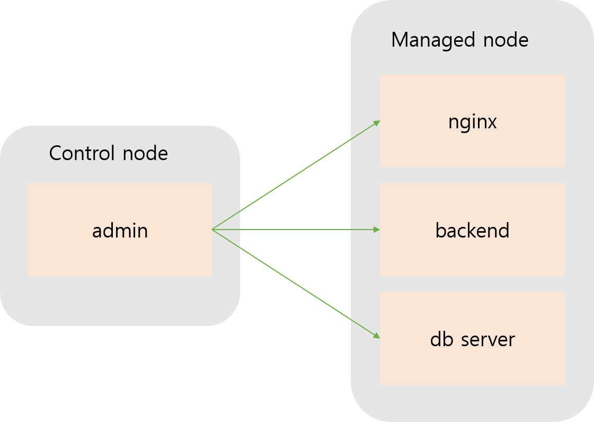

# ansible

## ansible 구성

-   Control Node
    -   admin 서버
-   Managed Node
    -   nginx 서버
    -   backend 서버
    -   db 서버




-   공통사항

    -   admin, nginx, backend, db server 모두 ansible 계정 사용

    -   작업 권한 설정

        -   sudo 명령에 대한 NOPASSWD 설정

    -   네트워크 설정 및 호스트네임 설정

    -   SSH 접속 허용

        -   SSH 서비스 설치 및 허용
        -   key 기반 인증 (패스워드 X)

        

-   admin 서버

    -   linux 계열 운영체제
    -   Python 설치
    -   ansible 설치


## 사전 설정

### 공통

root 계정으로 작업 (/root)

1.   git 설치 및 repository clone -> 4개 서버 모두
     -   편의를 위해 디렉토리명을 proj로 변경
     -   권한 변경 -> 755

```bash
$ yum install -y git
$ git clone https://github.com/JJdeva/linux-server-project.git
$ rename linux-server-project proj linux-server-project
$ chmod -R 755 proj
```


2.   sudo명령에 대한 권한 부여 -> 4개 서버 모두
     (패스워드 X)

```bash
# sudo_setting
$ sh /home/ansible/proj/setting/base/sudo_setting.sh
```


3.   ssh 설치 및 허용 (기본적으로 실행되어 패스)
     ssh가 안될 때 실행

```bash
$ sh /home/ansible/proj/setting/base/ssh_setting.sh
```

4.   hostname 변경

```bash
#admin
$ sudo hostnamectl set-hostname admin
# nginx
$ sudo hostnamectl set-hostname nginx
# backend
$ sudo hostnamectl set-hostname backend
# db
$ sudo hostnamectl set-hostname db
```


5.   네트워크 설정 (static ip)

-   `ip route`로 gateway 확인

| server | con-name | ipv4.addresses | ipv4.gateway | ipv4.dns |
| :-- | :-- |:-- |:-- | :--|
| admin | ansible | 10.0.2.100 | 10.0.2.2 | 8.8.8.8 |
| nginx | ansible | 10.0.2.200 | 10.0.2.2 | 8.8.8.8 |
| backend | ansible | 10.0.2.201 | 10.0.2.2 | 8.8.8.8 |
| db | ansible | 10.0.2.202 | 10.0.2.2 | 8.8.8.8 |

-   network 설정

```bash
# admin
$ sh /home/ansible/proj/setting/admin/admin_net_setting.sh
# nginx
$ sh /home/ansible/proj/setting/nginx/nginx_net_setting.sh
# backend
$ sh /home/ansible/proj/setting/backend/backend_net_setting.sh
# db
$ sh /home/ansible/proj/setting/db/db_net_setting.sh
```


6.   hosts 파일에 추가

```bash
# admin, nginx, backend, db 모두 같게 진행
$ cat /home/ansible/proj/setting/base/hosts >> /etc/hosts
```


### admin

1.   key 생성 및 복사
     -   주의 : ansible 계정의 키를 복사해줘야 한다.

```bash
$ su - ansible

$ ssh-keygen
$ ssh-copy-id ansible@nginx
$ ssh-copy-id ansible@backend
$ ssh-copy-id ansible@db
```


2.   키로만 로그인 가능하게 변경

```bash
$ vim /etc/ssh/sshd_config

38  PermitRootLogin without-password
65  PasswordAuthentication no

$ systemctl restart sshd
```


3.   python 3.9.12 설치

```bash
$ sh /home/ansible/proj/setting/admin/python_install.sh
```


4.   ansible 설치

```bash
$ yum install epel-release -y
$ yum install ansible -y
```


## ansible 설정

모든 작업은 admin서버의 ansible 계정의 home에서 이뤄진다.

```bash
$ su - ansible
$ cd ~
```

tasks 디렉토리를 하나 만들어주자

```bash
$ mkdir tasks
$ cd tasks
```


### Inventory

```ini
$ vim inventory

[was]
backend

[dbserver]
db

[webserver]
nginx
```


### Config file - ansible.cfg

```bash
$ vim ansible.cfg

[defaults]
inventory = inventory.ini
remote_user = ansible
ask_pass = false

[privilege_escalation]
become = true
become_ask_pass = false
```


### playbook

#### nginx 서버 설정

-   nginx_install.yaml


#### postgresql 설치

-   posgresql_install.yaml


#### backend 구성

-   backend_install.yaml

백엔드 경로는 /home/ansible/backend로 해주자. 여기에 manage.py가 있게


# 구성파일 정리

Directory Tree

```

```


# Virtualbox 설정

**모든 서버 동일 환경으로 구성**

OS : CentOS 7.9

Memory : 2048 MB

DISK : VHD 동적할당 40GB

ROOT : root / qwer1234

USER : ansible / qwer1234


# 임시

backend 그냥 구축

```bash
git clone https://github.com/JJdeva/linux-server-project.git

# 1. 파이썬 설치

# 2. pip upgrade
pip3 install --upgrede pip3

# 3. pip로 requirements.txt 설치
pip3 install -r requirements.txt
```

-   장고는 postgesql 11이상 지원한다함
-   psycopg2


postgresql 13버전 설치 

```bash
sudo yum install -y https://download.postgresql.org/pub/repos/yum/reporpms/EL-7-x86_64/pgdg-redhat-repo-latest.noarch.rpm

sudo yum -y install postgresql13 postgresql13-server

# db초기화 필요
sudo /usr/pgsql-13/bin/postgresql-13-setup initdb

#서비스 시작
sudo systemctl enable postgresql-13
sudo systemctl start postgresql-13

#원격데이터베이스 연결 활성화
sudo vim /var/lib/pgsql/13/data/postgresql.conf
# 59행에 list_addresses를 수정
# "*" : all
# '192.168.56.X' : 특정 ip
# 아마 백엔드 서버 아이피로 물리면되지 않을까


# 원격 연결 허용하게 설정
sudo vi /var/lib/pgsql/13/data/pg_hba.conf
#86행 밑에 추가
host	all	all	192.168.56.0/24	md5

#시스템 재시작
systemctl restart postgresql-13


# postgre admin 계정 업데이트
su - postgres
psql
#이건 보류?
```


---

# 플레이북 쪼가리


-   postgre 계정 생성

```yaml
- name: Connect to acme database and set user's password with no expire date
  postgresql_user:
    db: acme
    name: django
    password: mysupersecretword
    priv: "CONNECT/products:ALL"
    expires: infinity
```


-   장고 매니징

의존성 : virtualenv, django (admin에 필요)

```yaml
- django_manage:
	command: clearnup
	app_path: manage.py 경로
	
- django_manage:
	command: migrate
	app_path: manage.py 경로
	
- django_manage:
	command: "createsuperuser"
```

-   아마 마이그레이션만 하면 되지 않을까..?
-   슈퍼유저정도?


포스트그레스큐엘13 설치

https://quiz12.tistory.com/99


# psql 설정

```bash
su - postgres

qsql

sudo vi /var/lib/pgsql/13/data/postgresql.conf
-> listen_addresses = '10.0.2.201'


sudo vi /var/lib/pgsql/13/data/pg_hba.conf
host all 모두 10.0.2.0/24 md5


```


## gunicorn 서비스

proj.env생성 -> /home/ansible/backend

proj.service만들기 --> /etc/systemd/system/proj.service

```bash
[Unit]
Description=gunicorn daemon
After=network.target

[Service]
User=root
Group=root
WorkingDirectory=/home/ansible/backend
EnvironmentFile=/home/ansible/backend/proj.env
ExecStart=/usr/local/bin/gunicorn \
        --workers 2 \
        --bind unix:/tmp/gunicorn.sock \
        proj.wsgi:application

[Install]
WantedBy=multi-user.target
```

서비스 시작

```bash
sudo system enable proj
sudo systemctl start proj
```


## nginx 설정

/etc/nginx/conf.d/default.conf

```bash
server {
        listen 80;
        server_name 10.0.2.201;

        location = /favicon.ico { access_log off; log_not_found off; }

        location /static {
                alias /home/ansible/static;
        }

        location / {
                include proxy_params;
                proxy_pass http://unix:/tmp/gunicorn.sock;
        }
}
```


